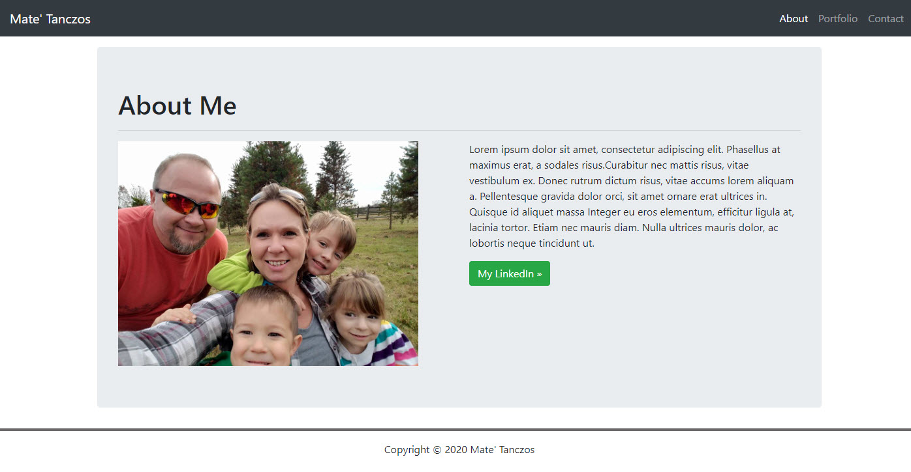

# Responsive-Portfolio

> This is my first responsive website using bootstrap 4.5, HTML5, CSS3. The website includes 3 pages which include About, Contact, and Portfolio, they will all shrink/ grow 
as the screen is resized.

## Table of contents
* [General info](#general-info)
* [Screenshots](#screenshots)
* [Technologies](#technologies)
* [Features](#features)
* [Status](#status)
* [Inspiration](#inspiration)
* [Contact](#contact)

## General info
I really enjoyed building this website using Bootstrap which made this project really easy to make. I also used semantic html which describes its meaning to both the browser and the developer

## Screenshots

## Technologies
* Bootstrap 4.5
* HTML5
* CSS3

## Features
List of features ready and TODOs for future development
* Awesome feature 1
* Awesome feature 2
* Awesome feature 3

To-do list:
* Wow improvement to be done 1
* Wow improvement to be done 2

## Status
Project is: _in progress_, _finished_, _no longer continue_ and why?

## Inspiration
Add here credits. Project inspired by..., based on...

## Contact
Created by [@flynerdpl](https://www.flynerd.pl/) - feel free to contact me!
